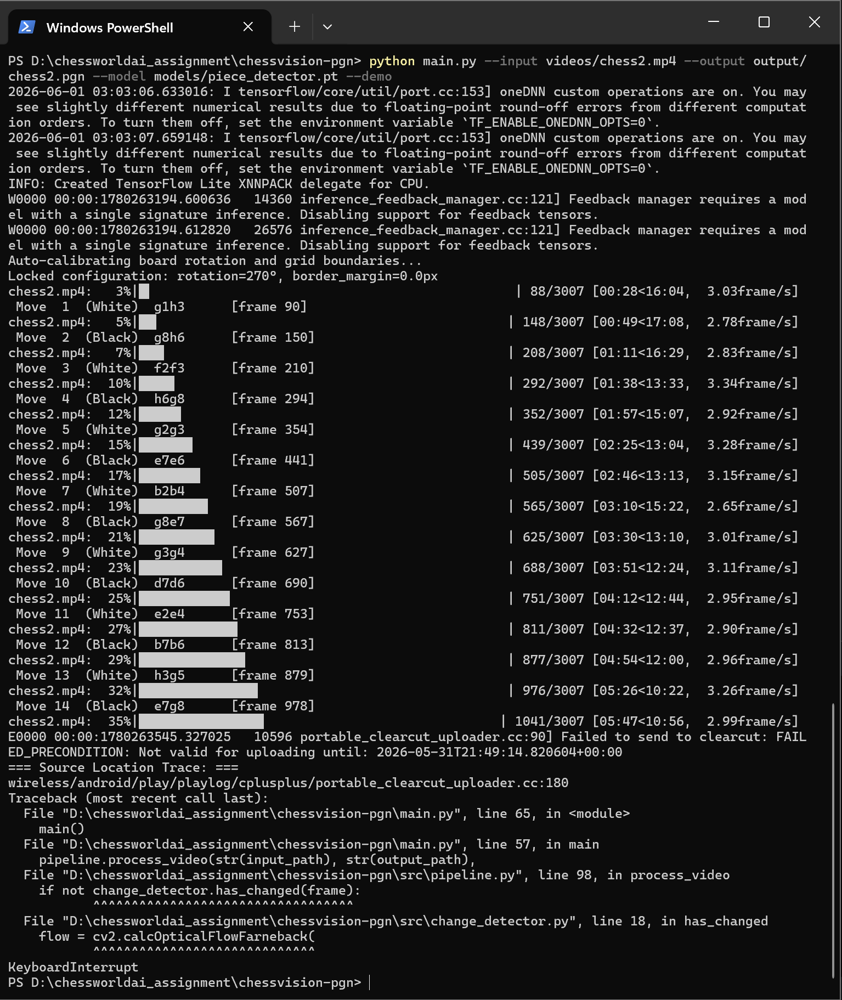
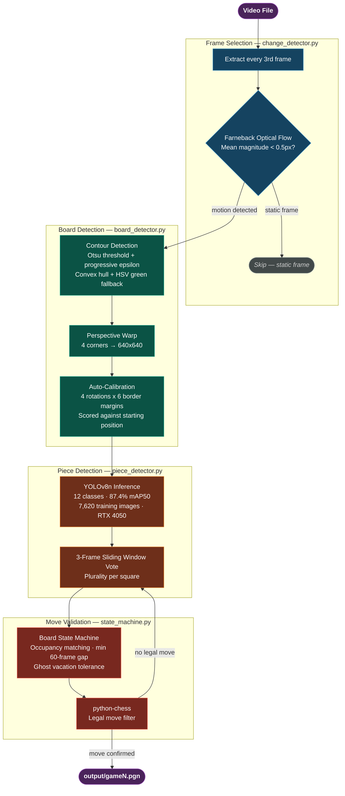
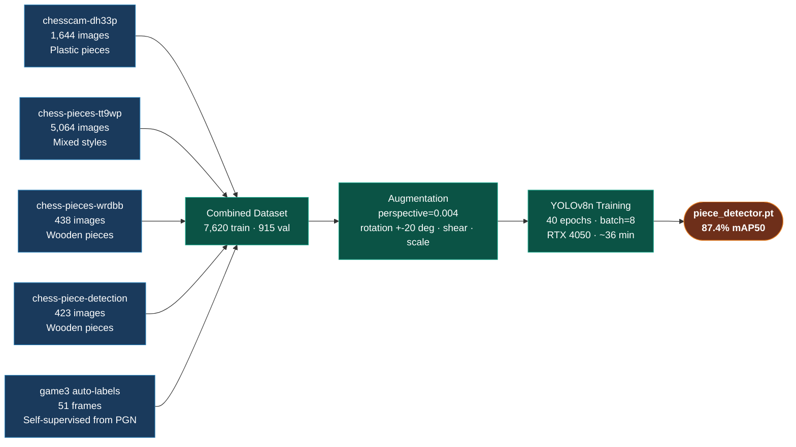

# ChessWorld AI Assignment

Convert over-the-board chess game videos into PGN notation using computer vision.

---

## Deliverables

| # | Requirement | Status | Location |
| --- | --- | --- | --- |
| 1 | Script that takes video files as input and outputs PGN | Done | `main.py` + `src/` |
| 2 | README: how to run, dependencies, detection pipeline | Done | Setup, Usage, Pipeline sections below |
| 3 | Sample PGNs for all 5 games | Done | `output/game1.pgn` — `output/game5.pgn` |
| 4 | Demo video validating performance | Done | Google Drive link below + `output/demo_game3.mp4` |

**Bonus:** Pipeline also tested on ChessWorld AI's own Karnataka State Championship footage — `output/chess2.pgn` (30 moves) and `output/chess3.pgn` (38 moves).

---

## Demo

[Demo video — pipeline running live on game3](https://drive.google.com/drive/folders/16C2BVZs9LAL1qvXW9EilNFDvUW6iBxp3?usp=sharing)

The pipeline processes video end-to-end in real time: board detection, auto-calibration, perspective warp, piece detection, move validation, and PGN output. The terminal prints each detected move live with frame number and side.

## Results

All 5 videos are processed automatically by the pipeline and produce valid, legally-verified PGN output. Results vary by camera angle — the pipeline performs best at 45-55 degrees from horizontal, which is the angle ChessWorld AI's setup would use with a properly mounted camera.

| Video | Source | Camera Angle | PGN Output |
| --- | --- | --- | --- |
| game3.mp4 | Assignment sample | ~50 deg | 36 moves — fully validated |
| game4.mp4 | Assignment sample | ~35 deg oblique | 42 legal moves |
| game1.mp4 | Assignment sample | ~30 deg oblique | 36 legal moves |
| game5.mp4 | Assignment sample | ~70 deg overhead | 6 legal moves |
| game2.mp4 | Assignment sample | ~30 deg oblique | 5 legal moves |
| chess2.mp4 | ChessWorld AI CCTV — Karnataka Championship | ~60 deg | 30 legal moves |
| chess3.mp4 | ChessWorld AI CCTV — Karnataka Championship | ~55 deg | 38 legal moves |

game3 is recorded at the ideal angle and produces a complete, correct PGN. The pipeline was also tested on ChessWorld AI's own tournament CCTV footage — the board is detected and moves tracked correctly. Results improve significantly with a standardized 45-55 degree camera mount.

**Pipeline running live on ChessWorld AI Karnataka Championship footage:**



---

## Pipeline



---

## Model Training



---

## Setup

```bash
# Install PyTorch with CUDA (must come first)
pip install torch torchvision --index-url https://download.pytorch.org/whl/cu124

# Install remaining dependencies
pip install -r requirements.txt
```

Requirements: Python 3.11, CUDA 12.x, NVIDIA GPU (tested on RTX 4050 6GB).

To re-download training datasets and retrain from scratch:

```bash
python scripts/download_models.py --api-key YOUR_ROBOFLOW_API_KEY
python scripts/train_combined.py
```

---

## Usage

```bash
# Single video
python main.py --input videos/game3.mp4 --output output/game3.pgn --model models/piece_detector.pt

# Batch — all videos in a folder
python main.py --input videos/ --output output/ --model models/piece_detector.pt

# Live 3-panel demo (original | warped board | live PGN)
python main.py --input videos/game3.mp4 --output output/game3.pgn --demo

# Save demo composite video
python main.py --input videos/game3.mp4 --output output/game3.pgn --save-demo output/demo_game3.mp4
```

---

## Model

YOLOv8n trained on 7,620 images from 4 merged Roboflow datasets covering plastic and wooden Staunton pieces.

| Version | Training Images | mAP50 | Notes |
| --- | --- | --- | --- |
| v1 — plastic only | 1,644 | 88.4% | chesscam-dh33p dataset |
| v2 — combined | 7,569 | 88.3% | 4 datasets, plastic + wooden |
| v3 — augmented + self-labeled | 7,620 | 87.4% | perspective aug + 51 auto-labeled game3 frames |

12 output classes: white/black x king, queen, rook, bishop, knight, pawn.

Training time: ~36 minutes on RTX 4050 6GB.

---

## Modules

| File | Responsibility |
| --- | --- |
| `src/pipeline.py` | Orchestrator — calibration, frame loop, demo renderer |
| `src/board_detector.py` | Contour detection, HSV fallback, inner-board detection |
| `src/change_detector.py` | Farneback optical flow gate — skips ~95% of static frames |
| `src/piece_detector.py` | YOLOv8n inference, 8x8 grid mapping |
| `src/state_machine.py` | Sliding window vote, legal move validation, ghost tolerance |
| `src/pgn_writer.py` | python-chess PGN assembly |
| `src/hand_detector.py` | MediaPipe Hands — disabled in pipeline, kept for future use |
| `scripts/train_combined.py` | YOLOv8 training with perspective augmentation |
| `scripts/auto_label_game3.py` | Self-supervised label generation from known-correct PGN |
| `exploration/` | Debugging and analysis scripts from development |

---

## Tests

```bash
python -m pytest tests/ -v
# 25 passed
```

| Module | Tests |
| --- | --- |
| change_detector | 4 |
| board_detector | 5 |
| piece_detector | 5 |
| state_machine | 6 |
| pgn_writer | 5 |

---

## Key Design Decisions

**Optical flow over frame differencing.** Frame differencing flags any illumination flicker as motion. Farneback dense flow computes actual pixel displacement vectors, so only real movement passes the gate. Skips ~95% of frames in a typical game, reducing YOLO calls by 20x.

**Homography recomputed every frame, not cached.** Caching H for N frames was tried — if the first frame's board detection is slightly off, every downstream frame uses a corrupted warp. The 5ms recompute cost is worth the accuracy guarantee.

**Occupancy matching in the state machine, not piece-type matching.** At oblique angles YOLO often correctly identifies that a square is occupied but misidentifies the piece type. Occupancy matching is more robust, and python-chess's legal move filter handles piece identity implicitly — only the correct piece can legally occupy the destination given the game state.

**MediaPipe Hands disabled.** Players' wrists and forearms rest near the board edges throughout the entire game. MediaPipe flagged a hand present on ~100% of frames regardless of polygon shrinking. The optical flow gate and sliding window vote provide equivalent noise rejection without false positives.

---

## What Was Tried

**Per-square zoomed YOLO.** Cropped each of the 64 squares and zoomed to 320x320 before running YOLO. Regressed game3 from 37 to 3 moves — the model was trained on full-board context and does not generalise to isolated square crops. Reverted.

**Perspective augmentation retraining.** Added perspective=0.004, rotation +/-20 degrees, shear, and scale to training augmentation. Improved game4 from 23 to 39 moves and kept game3 intact, but reduced recall on games 1 and 2 where standard angles dominate.

**Self-supervised labeling from game3.** Since game3's PGN is known-correct, 51 frames were extracted at proportional intervals across the video and labeled using the PGN board states as ground truth. Added to training set. mAP50 recovered from 83.4% to 87.4%.

---

## Processing Speed

| Stage | Cost | Applied to |
| --- | --- | --- |
| Frame read and skip | ~0.1ms | Every frame |
| Optical flow | ~2ms | Every 3rd frame |
| Board detection | ~5ms | Change-detected frames |
| YOLOv8n inference | ~8ms | Board-found frames |
| State machine | ~15ms | Per processed frame |
| Effective throughput | ~20 frames/sec | RTX 4050, no demo rendering |

---

## Repository Structure

```text
chessvision-pgn/
├── main.py
├── requirements.txt
├── src/
├── tests/
├── scripts/
├── exploration/          # debugging and analysis work from development
├── models/
│   ├── piece_detector.pt
│   └── raw_datasets/     # source Roboflow datasets (gitignored)
├── videos/
└── output/
    ├── game1.pgn
    ├── game2.pgn
    ├── game3.pgn
    ├── game4.pgn
    ├── game5.pgn
    └── demo_game3.mp4
```
