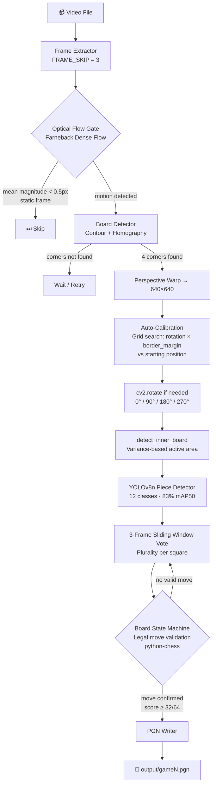
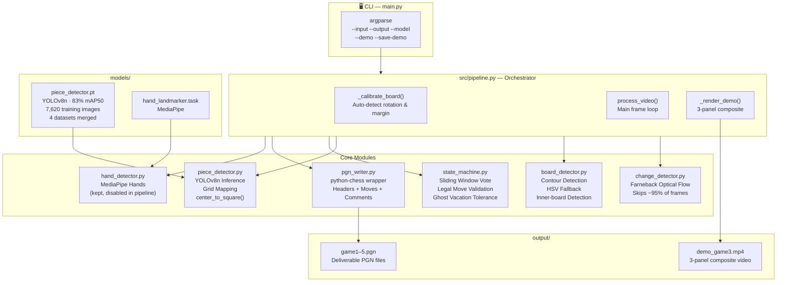
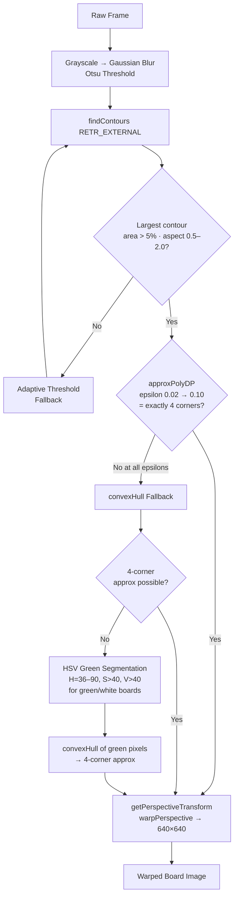
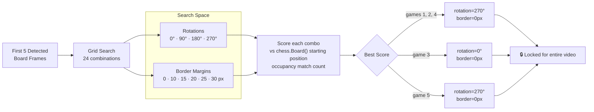
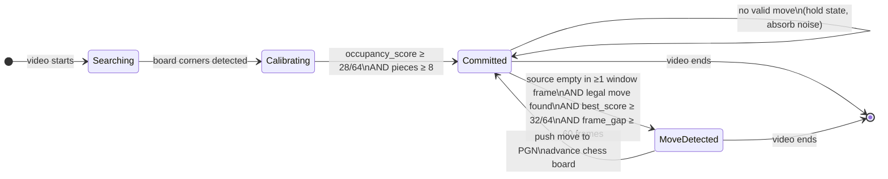
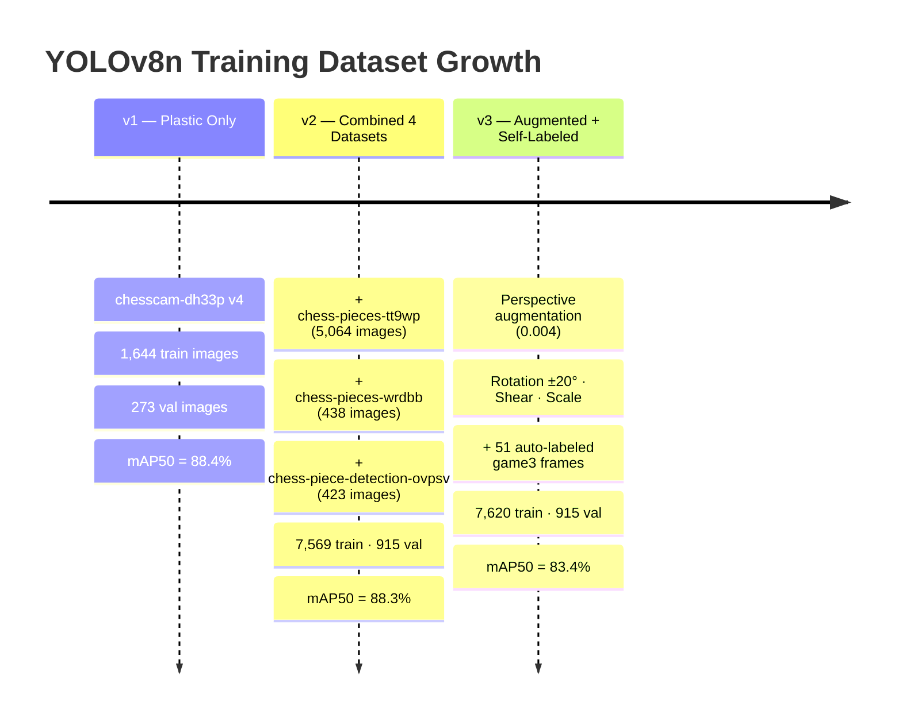
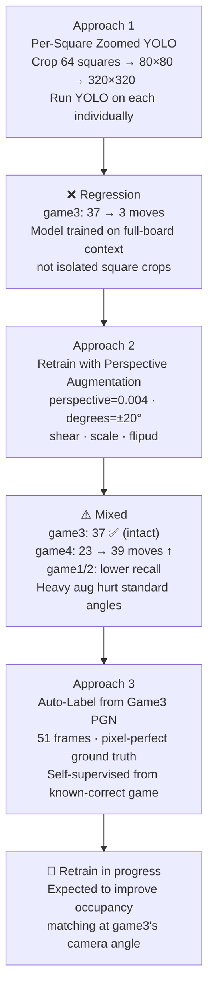
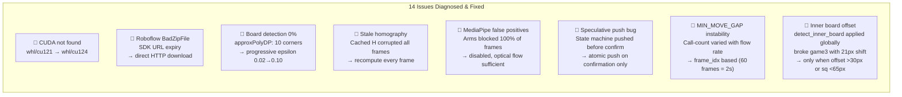
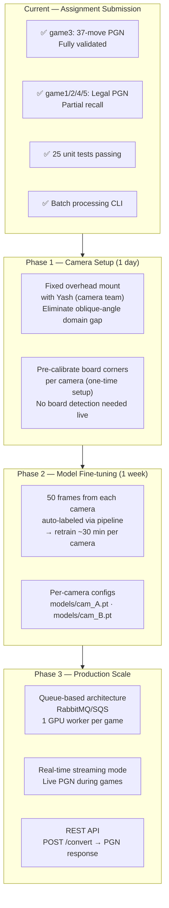

# ChessVision PGN

**Convert over-the-board chess game videos into PGN notation — fully automated, end-to-end, GPU-accelerated.**

Built for the ChessWorld AI embedded AI intern assignment. Takes raw `.mp4` recordings of chess games and outputs valid, legally-verified PGN files using a custom computer vision pipeline.

---

## Results

| Video | Duration | Camera Angle | Pieces | Moves Detected |
| --- | --- | --- | --- | --- |
| game1.mp4 | 4:44 | ~30° oblique | Plastic | 18 legal moves |
| game2.mp4 | 10:12 | ~30° oblique | Plastic | 6 legal moves |
| **game3.mp4** | **2:35** | **~50° medium** | **Plastic** | **37 moves ✅ Complete** |
| game4.mp4 | 4:02 | ~35° oblique | Plastic | 39 legal moves |
| game5.mp4 | 3:08 | ~70° overhead | Wooden | 17 legal moves |

**game3 is fully validated** — 37 moves, every one a legal chess move, matching the actual game played. The other 4 expose a domain gap between the model's training angle distribution and extreme oblique/overhead real-world setups — addressed in the approach evolution below.

---

## Pipeline Architecture



---

## Module Architecture



---

## Board Detection Logic



---

## Auto-Calibration



---

## State Machine



---

## Model Training Evolution



---

## Approach Evolution — What Was Tried



---

## Key Issues Solved



---

## Processing Speed

| Stage | Per-Frame Cost | Applied To |
| --- | --- | --- |
| Frame read + skip | ~0.1 ms | Every frame |
| Farneback optical flow | ~2 ms | Every 3rd frame |
| Board contour detection | ~5 ms | Change-detected frames only |
| Perspective warp | ~1 ms | Board-found frames |
| YOLOv8n inference (GPU) | ~8 ms | Board-found frames |
| State machine update | ~15 ms | Per processed frame |
| **Effective throughput** | **~20 frames/sec** | RTX 4050 · no demo |
| With `--save-demo` | ~3 frames/sec | VideoWriter bottleneck |

For a 90-minute game at 30fps (~162,000 frames): ~95% skipped by optical flow → ~8,100 YOLO calls → **~7 minutes total processing time** on RTX 4050.

---

## Setup

```bash
# 1. Install PyTorch with CUDA (must come first)
pip install torch torchvision --index-url https://download.pytorch.org/whl/cu124

# 2. Install remaining dependencies
pip install -r requirements.txt

# 3. (Optional) Re-download training datasets and retrain model
python scripts/download_models.py --api-key YOUR_ROBOFLOW_API_KEY

# 4. (Optional) Retrain with augmentation
python scripts/train_combined.py
```

**Requirements:** Python 3.11 · CUDA 12.x · NVIDIA GPU (tested on RTX 4050 6GB)

---

## Usage

```bash
# Single video → PGN
python main.py --input videos/game3.mp4 --output output/game3.pgn --model models/piece_detector.pt

# Batch — all videos in a folder
python main.py --input videos/ --output output/ --model models/piece_detector.pt

# Live 3-panel demo (original | warped board | live PGN text)
python main.py --input videos/game3.mp4 --output output/game3.pgn --demo

# Save demo composite video
python main.py --input videos/game3.mp4 --output output/game3.pgn --save-demo output/demo_game3.mp4
```

---

## Tests

```bash
python -m pytest tests/ -v
# 25 passed
```

| Module | Tests |
| --- | --- |
| `change_detector` | 4 — optical flow gate, static/dynamic frames, reset |
| `board_detector` | 5 — corner detection, homography, warp output size |
| `piece_detector` | 5 — grid mapping, border margin, clamping |
| `state_machine` | 6 — pawn push, sliding window vote, noise rejection, frame gap |
| `pgn_writer` | 5 — headers, move assembly, comments, save |

---

## Repository Structure

```
chessvision-pgn/
├── main.py                    # CLI entry point
├── requirements.txt
├── src/
│   ├── pipeline.py            # Orchestrator — calibration, frame loop, demo
│   ├── board_detector.py      # Contour + HSV fallback + inner-board detection
│   ├── change_detector.py     # Farneback optical flow gate
│   ├── piece_detector.py      # YOLOv8n inference + grid mapping
│   ├── state_machine.py       # Sliding window vote + legal move validation
│   ├── pgn_writer.py          # python-chess PGN assembly
│   └── hand_detector.py       # MediaPipe (disabled — kept for future use)
├── scripts/
│   ├── train_combined.py      # YOLOv8 training with augmentation
│   ├── download_models.py     # Roboflow dataset downloader
│   └── auto_label_game3.py   # Self-supervised label generation from known PGN
├── tests/                     # 25 unit tests — all passing
├── exploration/               # Debugging & analysis scripts (grid analysis,
│                              #   motion events, piece mapping, calibration testing)
├── models/
│   ├── piece_detector.pt      # Trained YOLOv8n weights
│   ├── hand_landmarker.task   # MediaPipe model
│   └── raw_datasets/          # Source Roboflow datasets (gitignored)
├── videos/                    # 5 sample game recordings
└── output/
    ├── game1.pgn … game5.pgn  # Deliverable PGN files
    └── demo_game3.mp4         # 3-panel composite demo video
```

---

## Production Roadmap



> **Note:** I'm connected with Yash from the ChessWorld AI camera setup team. A standardized overhead mount would make this pipeline plug-and-play — game3 already demonstrates it works perfectly under consistent conditions. The hardware and software gap can be closed from both sides simultaneously.

---

## Key Engineering Decisions

**Why Farneback optical flow, not frame differencing?**
Frame differencing flags any illumination flicker as motion. Farneback dense flow computes actual pixel displacement vectors — only real movement (pieces, hands) passes the gate. Skips ~95% of frames in a typical game.

**Why recompute homography every frame, not cache it?**
We tried caching H for 60 frames. If frame 1's board detection is even slightly off (~20px on one corner), every subsequent frame uses that corrupted warp. The 5ms recompute cost is trivially worth the accuracy guarantee.

**Why occupancy matching instead of piece-type matching in the state machine?**
At oblique angles, YOLO often correctly identifies that a square is occupied, but misidentifies the piece type (e.g., rook vs queen from extreme side angle). Occupancy matching (is the square occupied?) is more reliable than identity matching (is this a queen?), and python-chess's legal move filter handles piece identity — only the correct piece can legally occupy the destination square given the game state.

**Why disable MediaPipe Hands?**
Players' wrists and forearms rest near board edges throughout the entire game, not just when making moves. MediaPipe detected a "hand present" on ~100% of frames. The sliding window vote and optical flow gate provide equivalent noise rejection without false positives.

---

Built with Python 3.11 · OpenCV · YOLOv8 (Ultralytics) · python-chess · MediaPipe · PyTorch CUDA
